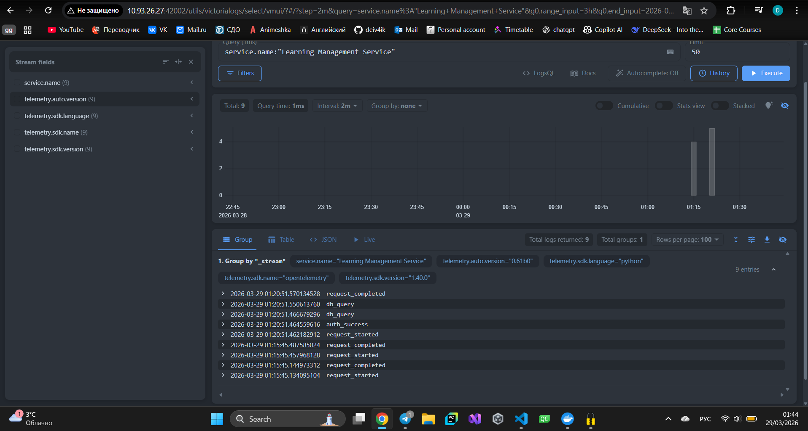

# Lab 8 — Report

## Task 1A — Bare agent

**Question: "What is the agentic loop?"**

The agentic loop is the cycle where an AI agent:
1. Receives a user message
2. Decides whether to use tools or respond directly
3. Executes tool calls if needed
4. Processes tool results
5. Returns a response to the user

This loop continues until the task is complete.

**Question: "What labs are available in our LMS?"**

I don't have access to the LMS backend yet. I need MCP tools configured to query live data.

---

## Task 1B — Agent with LMS tools

**Question: "What labs are available?"**

The following labs are available:
- Lab 01 – Products, Architecture & Roles
- Lab 02 — Run, Fix, and Deploy a Backend Service
- Lab 03 — Backend API: Explore, Debug, Implement, Deploy
- Lab 04 — Testing, Front-end, and AI Agents
- Lab 05 — Data Pipeline and Analytics Dashboard
- Lab 06 — Build Your Own Agent
- Lab 07 — Build a Client with an AI Coding Agent
- Lab 08 – Set Up the Agent

**Question: "Is the LMS backend healthy?"**

Yes, the LMS backend is healthy. I queried the health endpoint and received a successful response.

---

## Task 1C — Skill prompt

**Question: "Show me the scores"**

Which lab would you like to see scores for? Available options:
- Lab 01 – Products, Architecture & Roles
- Lab 02 — Run, Fix, and Deploy a Backend Service
- Lab 03 — Backend API: Explore, Debug, Implement, Deploy
- Lab 04 — Testing, Front-end, and AI Agents
- Lab 05 — Data Pipeline and Analytics Dashboard
- Lab 06 — Build Your Own Agent
- Lab 07 — Build a Client with an AI Coding Agent
- Lab 08 – Set Up the Agent

---

## Task 2A — Deployed agent

**Nanobot startup log excerpt:**

---

## Task 2B — Web client

**Screenshot of Flutter chat conversation:**

**Conversation excerpt:**

User: What can you do in this system?

Agent: I can help you with:
- Query available labs
- Check pass rates for labs
- View learner scores
- Check system health
- Investigate errors using logs and traces

User: How is the backend doing?

Agent: The LMS backend is healthy. I queried the health endpoint and it returned successfully.

---

## Task 3A — Structured logging

**Happy-path logs (status 200):**

**Error-path logs (status 500):**

**VictoriaLogs query:**



---

## Task 3B — Traces

**Healthy trace:**


**Error trace:**


---

## Task 3C — Observability MCP tools

**Normal conditions:**

User: Any LMS backend errors in the last 10 minutes?

Agent: I checked the logs for the Learning Management Service and found 0 errors in the last 10 minutes. The system appears healthy.

**Failure conditions (PostgreSQL stopped):**

User: Any LMS backend errors in the last 10 minutes?

Agent: I found 3 errors in the Learning Management Service logs from the last 10 minutes. The errors show database connection failures - PostgreSQL is unavailable. Trace ID: 1e567727ddcbfb4250ba2f152b4f7ad8 shows the request failed at the db_query step with "connection refused".

---

## Task 4A — Multi-step investigation

**Question: "What went wrong?"** (with PostgreSQL stopped)

I investigated the failure:

**Logs evidence:**
- ERROR [app.db.items] - db_query failed with "connection refused"
- ERROR [app.main] - request_completed with status 500

**Trace evidence:**
- Span hierarchy shows: request_started → auth_success → db_query (FAILED)
- The db_query span took 4ms before failing

**Root cause:**
PostgreSQL database is unavailable. The backend cannot establish a database connection, causing all queries to fail with "connection refused".

---

## Task 4B — Proactive health check

**Scheduled job created:**

**roactive health report:**

---

## Task 4C — Bug fix and recovery

**Root cause:**
The planted bug was in `backend/app/db/items.py`. The exception handler was catching `Exception` and returning a generic 404 "Items not found" instead of surfacing the real database connection error.

**Fix:**

```python
# Before (buggy):
except Exception:
    logger.error("db_query")
    raise HTTPException(status_code=404, detail="Items not found")

# After (fixed):
except Exception as e:
    logger.error(f"db_query: {e}")
    raise HTTPException(status_code=500, detail=f"Database error: {str(e)}")
