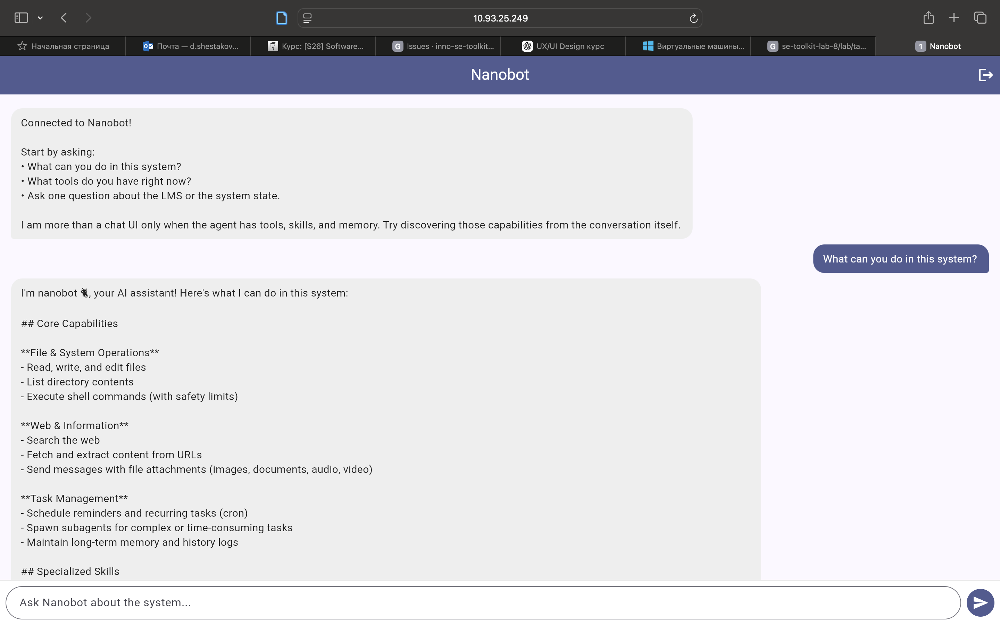
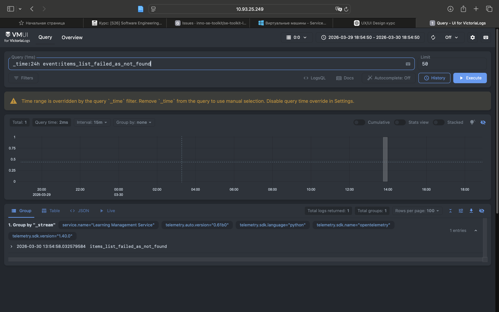
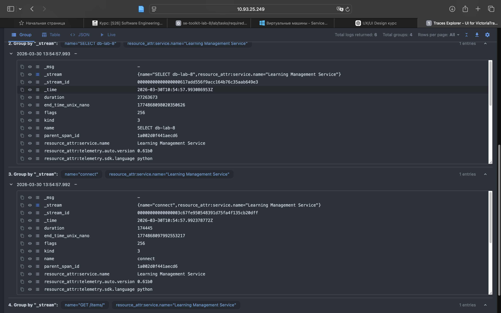
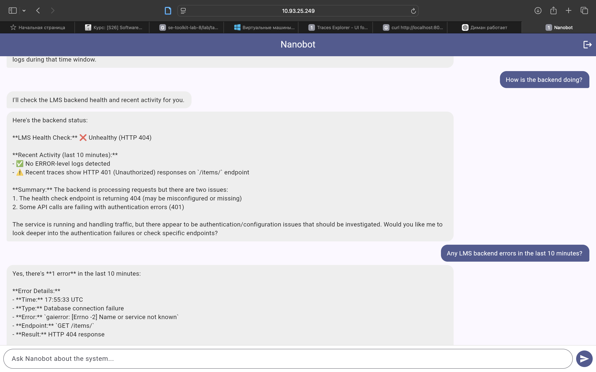
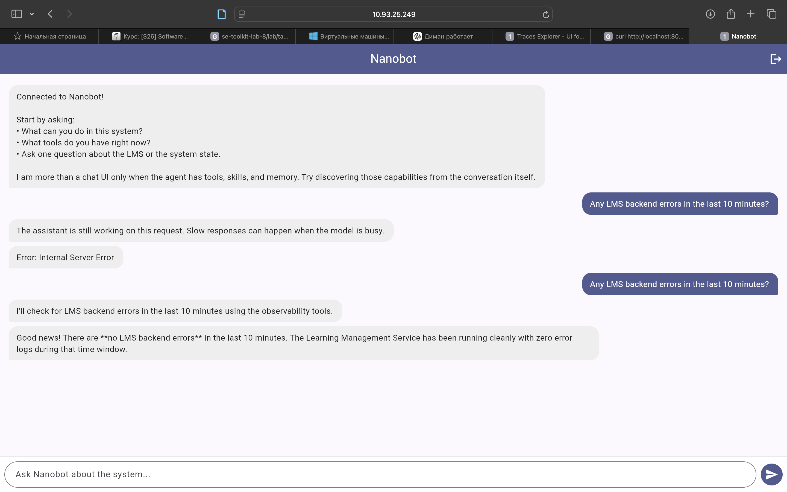
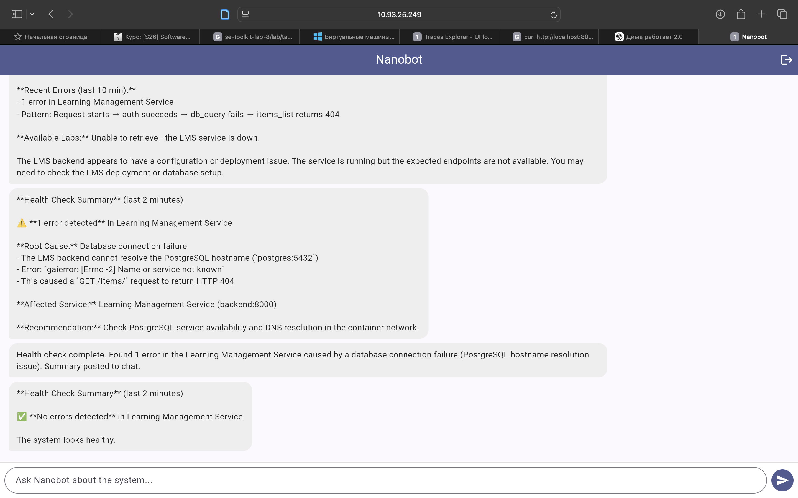
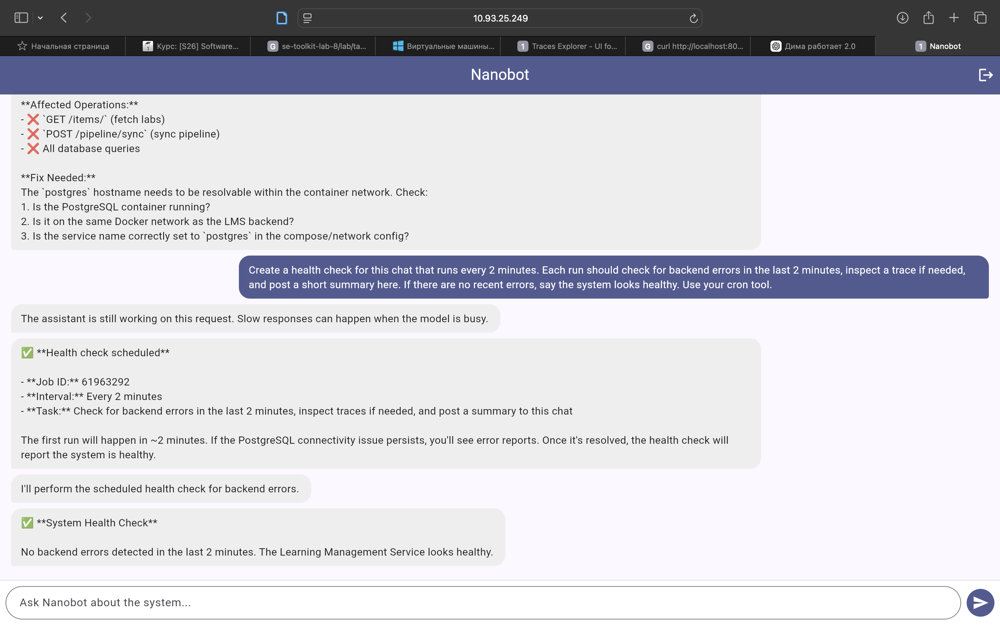

# Lab 8 — Report

Paste your checkpoint evidence below. Add screenshots as image files in the repo and reference them with ``.

## Task 1A — Bare agent

The agentic loop is the core reasoning cycle that an AI agent follows to accomplish tasks            
autonomously. It's the fundamental pattern that distinguishes an agent from a simple chatbot.        

The Basic Loop                                                                                       

                                                                                                     
 Perceive → Reason → Act → Observe → (repeat)                                                        
                                                                                                     

1. Perceive                                                                                          

The agent gathers information about the current state:                                               

 • User input/request                                                                                
 • Environment state (files, system, APIs)                                                           
 • Previous action results                                                                           
 • Memory/context                                                                                    

2. Reason                                                                                            

The agent processes information and decides what to do:                                              

 • Understand the goal                                                                               
 • Plan steps or strategies                                                                          
 • Select appropriate tools                                                                          
 • Anticipate outcomes                                                                               

3. Act                                                                                               

The agent executes its decision:                                                                     

 • Call a tool (e.g., read_file, exec, web_search)                                                   
 • Send a message                                                                                    
 • Modify state                                                                                      

4. Observe                                                                                           

The agent receives feedback:                                                                         

 • Tool outputs/results                                                                              
 • Errors or failures                                                                                
 • New information from the environment                                                              

5. Repeat                                                                                            

The loop continues until:                                                                            

 • The goal is achieved                                                                              
 • The agent determines it cannot proceed                                                            
 • The user intervenes                                                                               

Why It Matters                                                                                       

This loop enables autonomous problem-solving. Instead of just responding once, the agent can:        

 • Break complex tasks into steps                                                                    
 • Adapt based on results                                                                            
 • Recover from errors                                                                               
 • Learn from observations mid-task                                                                  

Example in Practice                                                                                  

When you asked me a question just now:                                                               

 1 Perceive: Read your question "What is the agentic loop?"                                          
 2 Reason: Recognized this as a knowledge question, no tools needed                                  
 3 Act: Generated this explanation                                                                   
 4 Observe: (Awaiting your response to continue)                                                     

The loop is what allows me to handle multi-step tasks like "find all Python files, check for errors, 
and fix them" — I iterate through the loop for each step. 

Based on my exploration of the workspace, I can see this is Lab 8 of the SE Toolkit course. The LMS in this lab tracks multiple labs throughout the course.
From the documentation, I can see references to:
Lab 1 through Lab 8
The LMS tracks pass rates, scores, completion status, and learner groups for each lab
The current lab is Lab 8 — “The Agent is the Interface”.

## Task 1B — Agent with LMS tools
🐈 nanobot
Here are the available labs:                                                                         

 1 Lab 01 – Products, Architecture & Roles                                                           
 2 Lab 02 — Run, Fix, and Deploy a Backend Service                                                   
 3 Lab 03 — Backend API: Explore, Debug, Implement, Deploy                                           
 4 Lab 04 — Testing, Front-end, and AI Agents                                                        
 5 Lab 05 — Data Pipeline and Analytics Dashboard                                                    
 6 Lab 06 — Build Your Own Agent                                                                     
 7 Lab 07 — Build a Client with an AI Coding Agent                                                   
 8 lab-08                                                                                            

Would you like more details about any specific lab, such as completion rates, pass rates, or top     
learners?                                                                                            

2026-03-30 12:19:16.708 | INFO     | nanobot.agent.loop:_process_message:479 - Response to cli:user: Here are the available labs:

1. **Lab 01** – Products, Architecture & Roles
2. **Lab 02** — Run, Fix, and Deploy a Back...

🐈 nanobot
Yes, the LMS backend is healthy. It currently has 56 items in the system with no errors reported.    

2026-03-30 12:23:03.609 | INFO     | nanobot.agent.loop:_process_message:479 - Response to cli:user: Yes, the LMS backend is healthy. It currently has 56 items in the system with no errors reported.

## Task 1C — Skill prompt

🐈 nanobot
I'll check what labs are available first, then show you the scores.                                                                             
2026-03-30 12:25:56.529 | INFO     | nanobot.agent.loop:_prepare_tools:253 - Tool call: mcp_lms_lms_labs({})

🐈 nanobot
There are 8 labs available. Which lab would you like to see the scores for? Or would you like me to show scores for all labs?                   

Here are the options:                                                                                                                           

 1 Lab 01 – Products, Architecture & Roles                                                                                                      
 2 Lab 02 — Run, Fix, and Deploy a Backend Service                                                                                              
 3 Lab 03 — Backend API: Explore, Debug, Implement, Deploy                                                                                      
 4 Lab 04 — Testing, Front-end, and AI Agents                                                                                                   
 5 Lab 05 — Data Pipeline and Analytics Dashboard                                                                                               
 6 Lab 06 — Build Your Own Agent                                                                                                                
 7 Lab 07 — Build a Client with an AI Coding Agent                                                                                              
 8 lab-08                                                                                                                                       

## Task 2A — Deployed agent

Reused the repo-local nanobot project from Task 1 as the deployable agent copy and packaged it as a Docker Compose service running `nanobot gateway`. Added a runtime entrypoint that reads Docker environment variables, injects the LLM and LMS MCP settings into the resolved Nanobot config, and then starts the gateway. Built the image with a multi-stage `uv` Dockerfile, enabled the `nanobot` service in `docker-compose.yml`, and verified that the service starts successfully, connects to the LMS MCP server, and starts the agent loop.

Using config: /tmp/nanobot.config.resolved.json
🐈 Starting nanobot gateway version 0.1.4.post5 on port 18790...
MCP server 'lms': connected, 9 tools registered
Agent loop started
## Task 2B — Web client



## Task 3A — Structured logging

Happy-path log excerpt:

2026-03-30 10:49:15,331 INFO [lms_backend.main] [main.py:62] [trace_id=5dc8106c83f6caa3e8740c7e0b0233ce span_id=97f48e6942406ed8 resource.service.name=Learning Management Service trace_sampled=True] - request_started
2026-03-30 10:49:15,332 INFO [lms_backend.auth] [auth.py:30] [trace_id=5dc8106c83f6caa3e8740c7e0b0233ce span_id=97f48e6942406ed8 resource.service.name=Learning Management Service trace_sampled=True] - auth_success
2026-03-30 10:49:15,333 INFO [lms_backend.db.items] [items.py:16] [trace_id=5dc8106c83f6caa3e8740c7e0b0233ce span_id=97f48e6942406ed8 resource.service.name=Learning Management Service trace_sampled=True] - db_query
2026-03-30 10:49:15,337 INFO [lms_backend.main] [main.py:74] [trace_id=5dc8106c83f6caa3e8740c7e0b0233ce span_id=97f48e6942406ed8 resource.service.name=Learning Management Service trace_sampled=True] - request_completed
INFO:     172.18.0.8:35204 - "GET /items/ HTTP/1.1" 200
INFO:     172.18.0.8:35204 - "GET /items/ HTTP/1.1" 200 OK

Error-path log excerpt:

2026-03-30 10:54:57,989 INFO [lms_backend.main] [main.py:62] [trace_id=5752e41351b6d12ace2426a687a76817 span_id=1a002d0f441aecd6 resource.service.name=Learning Management Service trace_sampled=True] - request_started
2026-03-30 10:54:57,990 INFO [lms_backend.auth] [auth.py:30] [trace_id=5752e41351b6d12ace2426a687a76817 span_id=1a002d0f441aecd6 resource.service.name=Learning Management Service trace_sampled=True] - auth_success
2026-03-30 10:54:57,991 INFO [lms_backend.db.items] [items.py:16] [trace_id=5752e41351b6d12ace2426a687a76817 span_id=1a002d0f441aecd6 resource.service.name=Learning Management Service trace_sampled=True] - db_query
2026-03-30 10:54:58,031 ERROR [lms_backend.db.items] [items.py:23] [trace_id=5752e41351b6d12ace2426a687a76817 span_id=1a002d0f441aecd6 resource.service.name=Learning Management Service trace_sampled=True] - db_query
2026-03-30 10:54:58,032 WARNING [lms_backend.routers.items] [items.py:23] [trace_id=5752e41351b6d12ace2426a687a76817 span_id=1a002d0f441aecd6 resource.service.name=Learning Management Service trace_sampled=True] - items_list_failed_as_not_found
2026-03-30 10:54:58,038 INFO [lms_backend.main] [main.py:74] [trace_id=5752e41351b6d12ace2426a687a76817 span_id=1a002d0f441aecd6 resource.service.name=Learning Management Service trace_sampled=True] - request_completed
INFO:     172.18.0.8:41614 - "GET /items/ HTTP/1.1" 404 Not Found
INFO:     172.18.0.8:41614 - "GET /items/ HTTP/1.1" 404


## Task 3B — Traces




## Task 3C — Observability MCP tools




## Task 4A — Multi-step investigation

## What Went Wrong

**Affected Service:** Learning Management Service (LMS)

**Root Cause:** Database connectivity failure — the LMS cannot resolve the hostname `postgres` to connect to the PostgreSQL database.

**Evidence:**
- **Logs:** 2 ERROR-level `db_query` failures in the last 10 minutes from the Learning Management Service
- **Trace:** The trace shows a `GET /items/` request failed because the database connection attempt resulted in:
  ```
  gaierror: [Errno -2] Name or service not known
  ```
  This indicates a DNS resolution failure when trying to reach `postgres:5432`

**Impact:** The LMS API is returning HTTP 404 errors because it cannot query the database to retrieve lab items.

**Likely Fix:** The PostgreSQL database container may be down, or there's a Docker network/DNS issue preventing the LMS service from resolving the `postgres` hostname.
## Task 4B — Proactive health check


## Task 4C — Bug fix and recovery
The root cause

The error was found in `backend/src/lms_backend/routers/items.py `inside `get_items()'. The route detected a wide "exception exception", registered "items_list_failed_as_not_found" and converted real server side/database failures to "HTTP 404 items not found'. This hid the real PostgreSQL/SQLAlchemy crash behind the misleading "not found" response.

Repair

I removed the generic exception handler from `get_items()` and enabled `read_items(session)`give a real error instead of rewriting it to `404 items not found'.

Error checking after correction

After rebuilding and re-deploying the server side, I stopped PostgreSQL again, called up the path to the list of laboratory work via chat and asked the agent "What went wrong?". The agent no longer reported the misleading "404 items not found." Instead, it revealed the real reason for the failure: the learning management service could not resolve or connect to "postgres:5432", and the trace data showed a database connection failure due to an incorrect query path.

Proper tracking

After restarting PostgreSQL and creating a new 2-minute cron health check in the chat, the next scheduled report stated that no server errors had been detected in the last 2 minutes and that the learning management service looked healthy.


